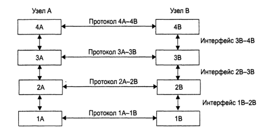
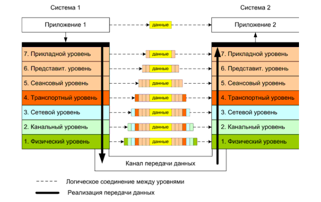

## cЛекция № 2. Сетевые модели и протоколы 

## Протокол и стек протоколов (см. рис. 2.1)

- Рисунок 2.1 – Понятие стека протоколов

Коммуникационный протокол – формализованный набор правил
    взаимодействия узлов сети;

Стек протоколов – иерархически организованный набор протоколов,
    достаточный для взаимодействия узлов в сети.

Эталонная модель OSI (Open System Interconnection)
Разработана в начале 80-х ISO как международный стандарт архитектуры компьютерной сети.
Определяет уровни взаимодействия в сетях с коммутацией пакетов,
стандартные названия уровней и функции, которые должен выполнять каждый уровень.
Уровни OSI (см. рис. 2.2)

1. Прикладной <==== Верхний
2. Представления данных
3. Сеансовый
4. Транспортный
5. Сетевой
6. Канальный
7. Физический <==== Нижний

    Рисунок 2.2 – Модель OSI

Физический уровень (physical layer)

Функция: 

передача потока битов по физическим каналам связи
(например, витая пара).
Реализуется на всех устройствах, подключенных к сети.

Пример протокола: 

спецификация 100Base-T4 стандарта Ethernet

Канальный уровень (data link layer)
Первый из уровней, который работает в режиме коммутации пакетов.
PDU (Protocol Data Unit) носит название кадр (frame).
Функции:
- для LAN: обеспечить доставку кадра между любыми узлами сети;
- для WAN: обеспечить доставку кадра между двумя соседними узлами,
соединенными индивидуальной линией связи. (PPP, HDLC).
Поддержание интерфейсов с физическим и сетевым уровнями.

Задачи:

- Обнаружение и коррекция ошибок;
- Проверка доступности среды передачи данных (иногда выделяют в отдельный подуровень – управления доступом к среде
(Media Access Control, MAC)
Реализуется компьютерами (адаптер+драйвер), мостами, коммутаторами и маршрутизаторами.
Сетевой уровень (network layer)
Служит для образования составной сети или межсетевого взаимодействия (internetworking)
Реализуется группой протоколов и маршрутизаторами.

Функции:

- Физическое объединение сетей;
- PDU сетевого уровня – пакет
Задачи:
- Связь между транспортным и канальным уровнями;
- определение маршрута;

Пример протоколов: 

- IP, IPX, RIP, BGP

Транспортный уровень (transport layer)
Обеспечивает верхним уровням стека передачу данных с нужной степенью надежности.
OSI определяет 5 классов транспортного сервиса: от 0 (низший) до 4
(высший).
Все протоколы с транспортного уровня и выше реализуются ПО сетевых узлов.
PDU (Protocol Data Unit, единица данных протокола) – сегмент или
дейтаграмма (датаграмма).

Задачи:

- Реализация транспортного соединения;
- Мультиплексирование/демультиплексирование нескольких
транспортных соединений в одном сетевом;
- Управление потоком.
Пример: TCP, UDP
Сеансовый уровень (session layer)
Обеспечивает управление взаимодействием сторон и предоставляет
средства синхронизации сеанса.

## Пример: SSH
Уровень представления данных (presentation layer)
Обеспечивает представление передаваемой информации не меняя ее
содержания.
Задачи:
- Отображение данных (из локальной формы в сетевую);
- Шифрование/дешифрование данных 
## (пример  SSL – SecureSocket Layer);
- Сжатие данных.
Прикладной уровень (application layer)
Набор протоколов, с помощью которых пользователи сети получают
доступ к разделяемым ресурсам, а также организуют совместную работу.
PDU – сообщение (message).
Примеры: FTP, SMB, NCP.
Модель DoD (или модель межсетевых связей)
Четырехуровневая модель сетевого взаимодействия, разработанная
Министерством обороны США (Department of Defense).
Практической реализацией этой модели является стек протоколов
TCP/IP, поэтому она также называется моделью TCP/IP.
Уровни модели:
1. Уровень приложений (объединяет функциональность прикладного
уровня, уровня представления данных и сеансового из модели OSI);
2. Транспортный уровень (примерно соответствует транспортному
уровню модели OSI).
3. Межсетевой (Internet) (соответствует сетевому уровню OSI).
4. Уровень доступа к сети (объединяет функциональность канального
и физического уровней OSI).
## Стандартные стеки коммуникационных протоколов:
- OSI
- TCP/IP
- IPX/SPX
- NetBIOS/SMB
- DECnet
- SNA
