## Цель работы: приобретение практических знаний и навыков в выборе и установке сетевых адаптеров, монтажу и разделке сетевого кабеля, физическому присоединению ЭВМ к кабельной системе при создании локальной компьютерной сети по технологии Ethernet.
## Материалы, оборудование, программное обеспечение: IBM PCсовместимый персональный компьютер, сетевая карта (для шины данных PCI) производительностью 10-100 Mbit/сек с разъемом RJ-45, кабель UTP категории 5, вилки RJ-45, обжимной инструмент.
## Материалы, оборудование, программное обеспечение: IBM PCсовместимый персональный компьютер, сетевая карта (для шины данных PCI)   производительностью 10-100 Mbit/сек с разъемом RJ-45, кабель UTP категории 5, вилки RJ-45, обжимной инструмент.

                                  Теоретическое введение
Сетевой стандарт Ethernet был разработан в 1975-х г. в исследовательском
центре корпорации Xerox, после чего доработан совместно DEC, Intel и
XEROX (отсюда сокращение DIX) и впервые опубликован как 'Blue Book
Standart' для Ethernet I в 1980 г. Этот стандарт получил дальнейшее развитие и
в 1985 г. вышел новый - Ethernet II (известный также как DIX).

На основе стандарта Ethernet DIX был разработан стандарт IEEE 802.3,
одобренный в 1985 году для стандартизации комитетом по LAN IEEE (Institute
of Electrical and Electronics Engineers). В зависимости от вида физической среды
передачи данных стандарт IEEE 802.3 имеет модификации (число 10 в начале
каждой обозначает скорость передачи данных 10 Мбит/сек):

• 10Base-5 (применяется коаксиальный кабель диаметром 0,5 дюйма - т.н.
толстый коаксиал с волновым сопротивлением 50 ом; максимальная длина
сегмента сети без повторителей 500 м, считается бесперспективным).

• 10Base-2 (коаксиальный кабель диаметром 0,25 дюйма - т.н. тонкий
коаксиал, волновое сопротивление 50 ом; максимальная длина сегмента сети
без повторителей 185 м, считается бесперспективным).

• 10Base-T (кабель на основе неэкранированной витой пары - UTP, Un
shielded Twisted Pair; физическая топология - звезда с концентратором в
центре, максимальное расстояние между концентратором и конечным
узлом - до 100 м).

• 10Base-F (волоконно-оптический кабель, топология сети аналогична
10BaseT; варианты: FOIRL допускает расстояние до 1000 м, 10Base-FL и
10Base-FB - до 2000 м).

В 1995 г. принят стандарт Fast Ethernet (IEEE 802.3u), в 1998 г. - Gigabit Ethernet (IEEE 802.3z), в 2002 г. - 10 Gigabit Ethernet (IEEE 802.3ae).
Ethernet и Fast Ethernet применяют один и тот же метод разделения среды
передачи данных CSMA/CD (Carrier Sense Multiple Access with Collision Detection, метод коллективного доступа с опознаванием несущей и обнаружением
коллизий).

Кабель UTP является наиболее дешевым (при обеспечении достаточной
скорости передачи данных и простоте монтажа). UTP-кабели категории 1
применяются в основном для телефонной разводки, UTP категории 3 служат
для передачи как голоса, так и данных при невысокой производительности
(диапазон частот до 16 MHz). Для высокоскоростных протоколов при передаче на большие расстояния могут применяться (более дорогие) кабели UTP
категорий 6 и 7 (экран вокруг каждой пары и вокруг всех жил соответственно, рабочие частоты до 300 и 600 MHz).

В настоящее время при создании локальных компьютерных сетей практически всегда (для технологий Ethernet, Fast Ethernet и Gigabit Ethernet) применяют кабель UTP категории 5 (8 попарно скрученных медных жил, активное
сопротивление не более 9,4 ом на 100 м, полное волновое сопротивление 100
ом на частоте 100-120 MHz, затухание сигнала 0,8-22 дБ на частотах от 64 kHz
до 100 MHz). Каждый провод кабеля UTP маркирован цветом (синий и белый
с синими полосками, оранжевый и белый с оранжевыми полосками, зеленый
6
и белый с зелеными полосками, коричневый и белый с коричневыми
полосками по скрученным парам соответственно), для UTP-кабеля применяются разъемы RJ-45 (рис. 1.1).

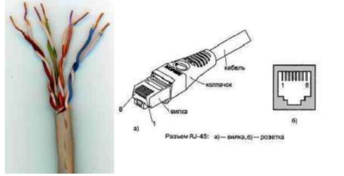
## Рисунок 1.1 — Кабель UTP категории 5 (слева) и разъем RJ-45, показаны
вилка (plug) и розетка (jack).

Отрезок UTP-кабеля (обычно не более 5 метров) со смонтированными
на его концах вилками RJ-45 называют Patch cord'ом. Вилки RJ-45 являются
неразборными, при необходимости кабель просто отрезают около вилки и
монтируют новую.

Для технологии Ethernet используется топология 'звезда' с концентратором в центре, причем определены порты типа MDI (Medium Depended Interface, разъем сетевого адаптера) и MDIX (MDI crossing, разъем портов сетевого
концентратора), см. рис. 1.2.

При соединении MDI-MDIX (подключение конечных узлов сети к
портам активного оборудования) используется 'прямой' кабель (рис. 1.3a),
при соединении MDI-MDI (непосредственное соединение адаптеров
компьютеров, рис. 1.2б) или MDIX-MDIX (соединение двух
коммуникационных устройств) используют 'перекрестный' (кроссовый)
кабель (рис. 1.3б, причем на рис. 1.2 'перекрестный' кабель обозначен
символом x).

## Рисунок 1.2 — Сеть 10BaseT/1 00BaseTX: a) - звезда, б) - непосредственное соединение двух компьютеров (двухточечное соединение)

Большинство современных коммутаторов используют функцию
автоопределения типа кабеля (MDI или MDIX), что почти исключает
вероятность ошибочного подсоединения.

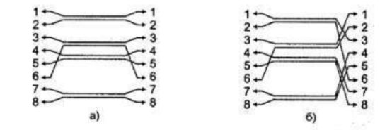
## Рисунок 1.3 — Интерфейсные кабели Ethernet: a) - 'прямой', б) -
'перекрестный' (кроссовый)

В 10- и 100-мегабитном Ethernet'е (10BaseT/100BaseTX) названия
контактов содержат символы TX (transmitter, передатчик), RX (receiver,
приемник) со знаками '+' и '—' и из 8 жил используется только половина (рис.
1.3); для Gigabit Ethernet (1000BaseTX) используются все 8 медных жил
(обмен данными по 4 парам жил в обоих направлениях одновременно),
подсоединение соответствует табл. 1.1.

## Таблица 1.1. — Разъем RJ-45 адаптера Ethernet.
|Контакт|10BaseT/100BaseTX|1000BaseTX|
|--|--|--|
|1|Tx+|BI_D1+|
|2|Tx-|BI_D1-|
|3|Rx++|BI_D2+|
|4|не подсоединен|BI_D3+|
|5|не подсоединен|BI_D3-|
|6|Rx-|BI_D2-|
|7|не подсоединен|BI_D4+|
|8|не подсоединен|BI_D4-|

Сигналы по каждой двухпроводной линии
передаются дифференциальным способом (с
противоположной полярностью по линиям '+' и '-
'), причем входные и выходные цепи сетевых
адаптеров имеют гальваническую развязку (рис.
снизу).
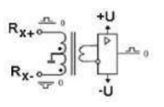

Кабель UTP соединяется с вилкой RJ-45 без применения пайки. При
монтаже вилки RJ-45 на кабель UTP-5 удаляют внешнюю оболочку кабеля
на длину 12,5 мм, см. рис. 1.4б; для удаления оболочки на специальном
инструменте (рис. 1.4a) имеется специальный нож и ограничитель длины
удаляемой оболочки. Снимать изоляцию с жил не нужно, однако жилы
следует расположить на плоскости в соответствие со схемой заделки (правое
8
изображение из рис. 1.4б и нижеследующие схемы).

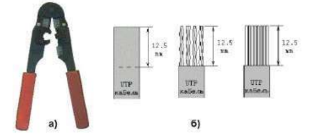
## Рисунок 1.4 — Обжимной инструмент для разделки UTP-кабеля (a) и последовательность снятия внешней оболочки с сетевого кабеля (б).

Варианты заделки проводов (разводка проводов витой пары) показаны
ниже ('прямой' кабель). В качестве схем заделки для 8-ми жильного кабеля
равноценно можно использовать схему 568A или 568B (но одинаковую для
данной сети, рекомендуется первая), для 4-х жильного кабеля используется
схема согласно последнему из рисунков.

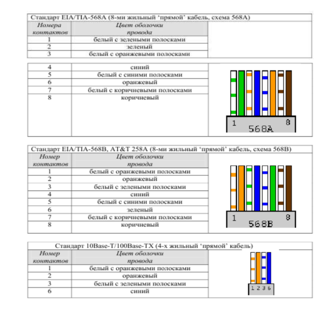
После описанного расположения жил на плоскости следует повернуть
вилку контактами к себе (как на рис. 1.5) и аккуратно надвинуть на кабель до
упора, чтобы провода прошли под контактами. Вид вилки с кабелем внутри
показан на рис.1.5в.

Последним действием является обжим вилки. На
обжимном инструменте имеется специальное гнездо,
в которое вставляется вилка с проводами, после чего
нажатием на ручки инструмента вилка обжимается
(рис. a) справа). При этом контакты (на рис. показаны
желтым цветом) будут утоплены внутрь корпуса, прорежут изоляцию проводов и обеспечат надежный
контакт жил кабеля с контактами вилки. Фиксатор
провода также должен быть утоплен в корпус
(нажатие по стрелке 1 на рис. снизу).

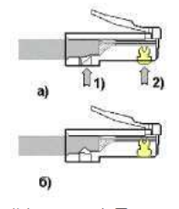

В крайнем случае (если нет обжимного
инструмента) можно обжать разъем RJ-45 тонкой отверткой (рис. слева). При
этом следует утопить все 8 шт. контактов (1) в корпус, а затем утопить и
фиксатор провода (3). Полезно подложите что-либо под разъем, чтобы не
сломать его фиксатор (2). Это не есть самый надежный способ монтажа, но
приемлемый.

Для непосредственного соединения двух компьютеров можно
рекомендовать показанное ниже соединение ('перекрестный' кабель),
приведен вариант 4-х жильного т.н. 'нуль-модемного кабеля'.
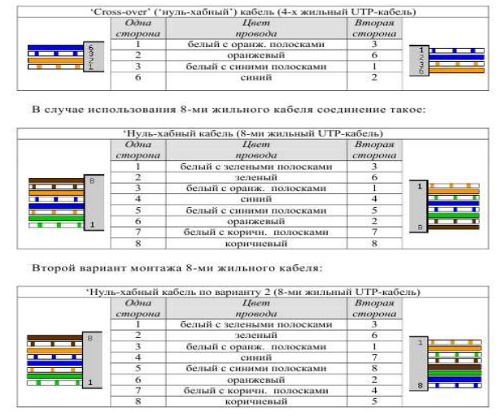
## Рисунок 1.5

При тщательном выполнении монтажа вилок RJ-45 достигается
устойчивый контакт между жилами кабеля и контактами вилки. В редких
случаях (выявляемых обычно уже на этапе настройки программного
обеспечения поддержки сети) требуется проверка физического соединения
портов (выполняется с помощью кабельных тестеров или просто омметром).

Розетка представляет собой гнездо (разъем) соединителя с каким-либо
приспособлением для крепления кабеля и корпусом для удобства монтажа,
обычно в комплекте поставляется и вилка. Внешняя розетка представляет
собой небольшую пластмассовую коробочку, к которой прилагается шуруп и
двухсторонняя наклейка для монтажа на стену. Такая розетка служит
окончанием сетевого кабеля, обычно разводимого по стене помещения и
помещенного в коробах. В т.н. розетках типа KRONE для монтажа кабеля
UTP-5 используется специальная пластина с щелью, в которую заталкивается
провод, при этом прорезается изоляция и жила кабеля входит в надежный
контакт с пластиной (пайка не применяется). Для монтажа проводов имеется
специальный инструмент, который помимо заталкивания проводов в щель
обрезает лишние его куски. В любом случае настоятельно рекомендуется
после тщательного замера длины кабеля оставить по 1-1,5 м с каждой стороны
для монтажа и укладки части кабеля в непосредственной близи от компьютера
(или иного сетевого устройства).

Сетевая карта или сетевой адаптер (NIC, Network Interface Card) - плата
расширения, обычно вставляемая в разъем системной (материнской) платы
(main board) компьютера; современные системные платы обычно имеют
встроенную сетевую карту. На рис. 1.6 показана сетевая карта шины данных
PCI: 1 - разъем под витую пару (RJ-45), 2 - светодиодный индикатор
активности сети, 3 - шина данных PCI, 4 - панелька под микросхему BootROM
(для загрузки операционной системы компьютера не с локального диска, а с
сервера сети), 5 - микросхема контроллера платы, 6 - коннектор подключения
3-х проводного кабеля к системной плате для 'пробуждения' по сети (Remote
Wake Up; для этого передается специальный кадр Magic Packet, при приеме
которого ПК «просыпается»).

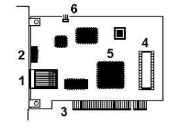

## Рис. 1.6 сетевая карта шины данных PCI

Для определения точки назначения пакетов в сети Ethernet используется
т.н. MAC (Media Control Access)-адрес. Это уникальный серийный номер,
присваиваемый каждому сетевому устройству Ethernet для идентификации
его в сети. MAC-адрес присваивается адаптеру его производителем, но может
быть изменен программно. В обычном режиме работы сетевые адаптеры
просматривают весь проходящий сетевой трафик и ищут в каждом кадре
свой MAC-адрес. Если такой находится, то устройство (адаптер) обрабатывает
этот кадр. MAC-адрес имеет длину 6 байт (48 бит) и обычно записывается в
шестнадцатеричном виде, например, 12:34:56:78:90:AB (двоеточия между
байтами делают число более читабельным).
Каждый производитель присваивает адреса из принадлежащего ему диапазона адресов. Первые три байта адреса определяют производителя, напр.:

    • 00000C Cisco
    • 00000E Fujitsu
    • 00001D Cabletron
    • 00004C NEC Corporation
    • 000061 Gateway Communications
    • 000062 Honeywell
    • 0080C8 D-Link
    • 00A024 3Com
    • 00C049 US Robotics

Обычно все поддерживающие высшие скорости обмена данными сетевые
адаптеры работают и на меньших скоростях (если комплементарное устройство не поддерживает данной скорости, но совместимо по стандарту
Ethernet). Позволяет это протокол согласования режимов (auto negotiation,
процесс основан на обмене специальными служебными импульсами), выполняемый каждый раз при установлении соединения после физического
подключения (при инициализации портов) и позволяющий выбрать
наиболее эффективный из режимов, доступных обоим портам.

Для обеспечения корректной работы каждой сетевой платы необходимо
определить для нее адрес ввода-вывода (In/Out port) и номер прерывания
(IRQ). Конфигурирование сетевой платы заключается в настройке ее на свободные адрес и прерывание, которые затем будут использоваться операционной системой. Адрес (In/Out port) и прерывание (IRQ) для каждой сетевой
платы должно быть отличным от других устройств компьютера. Современные
сетевые карты поддерживают технологию Plug-end-Play и автоматически
выполняют эту операцию. Программная поддержка сетевых карт
обеспечивается драйверами, для операционной системы Windows
возникновение проблем с драйверами маловероятно.

Контрольные вопросы для самопроверки

• Какие сетевые кабели использует технология Ethernet? Что такое
кабель UTP? В чем его достоинства и недостатки?

Технология Ethernet чаще всего использует кабели типа «витая пара» (UTP, FTP) с разъемами RJ-45 для локальных сетей (категории 5e, 6, 6a). UTP (Unshielded Twisted Pair) 

Что такое кабель UTP (Unshielded Twisted Pair)?

Это самый распространенный тип сетевого кабеля для построения компьютерных сетей (Ethernet). Он состоит из четырех пар медных проводников, скрученных между собой для снижения электромагнитных помех от внешних источников.

Достоинства UTP:

1.    Низкая стоимость: UTP-кабели значительно дешевле экранированных аналогов (FTP/STP).

2. Гибкость и легкость: Неэкранированные кабели удобны в монтаже, их легко прокладывать в стенах и коробах.

3.    Простота разделки: Кабели просты в обжиме, не требуют заземления.

4.    Высокая скорость: Поддерживают передачу данных на высоких скоростях (1–10 Гбит/с) в зависимости от категории (5e, 6, 6a). 

Недостатки UTP:

1.    Подверженность помехам: Из-за отсутствия экрана UTP чувствителен к электромагнитным помехам и радиочастотным помехам, особенно в промышленных условиях.

2.    Ограничение по длине: Максимальная длина сегмента без усилителей составляет 100 метров.

3.    Безопасность: Данные могут быть перехвачены, так как кабель не защищен от излучения сигнала. 

• Что такое сетевые устройства MDI и MDIX? Для соединения каких
устройств необходим 'перекрестный' (кроссированный) кабель?

MDI (Medium Dependent Interface) и MDIX (MDI Crossover) — это типы портов Ethernet, определяющие, какие контакты используются для передачи (Tx) и приема (Rx) данных.

* MDI (Medium Dependent Interface): Используется на конечных устройствах (ПК, сетевые карты, маршрутизаторы), пары 1-2 и 3-6 работают «прямо».

* MDIX (Medium Dependent Interface Crossover): Используется на коммутаторах и концентраторах. Внутри порта произведена перекрестка (Tx подключен к Rx), чтобы соединять устройства с конечными устройствами.

* Auto MDI/MDIX: Современная технология, автоматически определяющая тип кабеля и порт, делая использование перекрестных кабелей практически ненужным. 

Когда нужен перекрестный (кроссоверный) кабель:
Перекрестный кабель необходим для прямого соединения двух устройств одного типа, чтобы передатчик (Tx) одного устройства попадал на приемник (Rx) другого

• Почему при монтаже вилки RJ-45 на кабель нет необходимости
снимать
изоляцию с отдельных жил кабеля?

* При монтаже вилки RJ-45 (обжиме витой пары) изоляцию с отдельных жил снимать не нужно, так как внутри коннектора установлены специальные острые контакты-"ножи". При обжиме кримпером они прорезают пластиковую изоляцию жил и надежно фиксируют медный проводник, обеспечивая электрический контакт. 

• Что такое 'нуль-модемный' кабель и для каких целей он применяется?

* Нуль-модемный кабель (RS-232) — это специальный кабель для прямого соединения двух компьютеров или устройств (DTE) через COM-порты, где линии приема (
) и передачи (
) перекрещиваются, а модемы не используются. Он применяется для обмена файлами, управления сетевым оборудованием (маршрутизаторы), отладки ядер ОС и настройки промышленных контроллеров. 

Основные цели и применение:

* Передача данных: Соединение двух ПК напрямую для передачи файлов (например, в старых системах или через Interlink).
Управление оборудованием: Подключение компьютера к консольным портам серверного оборудования, коммутаторов и маршрутизаторов для настройки.
Обновление ПО: Обновление прошивок спутниковых ресиверов, POS-систем и терминалов.
Отладка (Debug): Использование разработчиками для отладки ядра операционных систем (например, Linux/Windows).

• Каким образом однозначно идентифицируются сетевые адаптеры? С
какой
целью введена возможность изменения MAC-адреса?

Сетевые адаптеры однозначно идентифицируются MAC-адресом — уникальным аппаратным адресом, присвоенным каждому устройству производителем оборудования. MAC-адрес представляет собой шестнадцатеричное число длиной 48 бит, записанное в виде шести пар символов

Зачем нужна возможность изменения MAC-адреса?

1. Обход ограничений
   Некоторые сети используют фильтрацию по MAC-адресам для ограничения доступа пользователей или устройств. Изменяя MAC-адрес, пользователи могут обойти такие ограничения.

2. Улучшение конфиденциальности
   Постоянный использование одного MAC-адреса позволяет отслеживать перемещения устройства между различными сетями. Периодическое изменение адреса повышает уровень анонимности.

3. Отладка и тестирование сетей
   Для разработчиков и инженеров возможность смены MAC-адреса полезна при тестировании различных сценариев поведения сетевого окружения.

• В чем заключается процесс конфигурирование сетевой платы? Какие
параметры при этом настраиваются?

Процесс конфигурации сетевой платы включает настройку ряда важных параметров, необходимых для правильной работы адаптера в локальной или глобальной сети. Основные аспекты настройки включают следующие шаги и параметры:

 Шаги процесса конфигурирования:

1. Определение типа подключения: проводное (Ethernet), беспроводное (Wi-Fi) или другое.
2. Настройка IP-адреса: статический или динамический (DHCP).
3. Выбор скорости передачи данных: автоопределение или ручная настройка.
4. Установка маски подсети: определение размера сети.
5. Назначение шлюза по умолчанию: выбор маршрута выхода в Интернет.
6. Указание DNS-серверов: назначение серверов имен доменов.

 Настраиваемые параметры:

1. IP-адрес: уникальный числовой идентификатор устройства в сети.
2. Маска подсети: определяет диапазон IP-адресов, используемых в конкретной сети.
3. Шлюз по умолчанию: устройство, используемое для отправки пакетов вне локальной сети.
4. DNS-серверы: адреса серверов, преобразующих имена хостов в IP-адреса.
5. Скорость передачи данных: частота обмена информацией (обычно выбирается автоматически).
6. Тип подключения: Ethernet, Wi-Fi, VPN и др.
7. Протоколы безопасности: WPA/WEP/IEEE 802.1X и прочие механизмы защиты данных.

Задание к лабораторной работе
Студент получает задание на выполнение
работы; типовыми заданиями являются:
• Смонтировать UTP-кабель для соединения ПК с сетевым устройством
(концентратором, коммутатором).
• Смонтировать UTP-кабель для непосредственного соединения
двух ПК.
Методические указания и порядок выполнения работы
Монтаж предполагает разделку концов кабеля в соответствие с
поставленной целью (причем преподавателем может быть предложен как 4-х,
так и 8-ми жильный UTP-кабель), обжим вилки RJ-45, проверка контакта
осуществляется кабельным тестером или омметром и проверяется
преподавателем.
Сетевая карта устанавливается в свободный разъем на системной плате
ПК (если на последней не имеется встроенного сетевого адаптера), при
включении ПК конфигурируется технологией Plug-end-Play. Используемые
адреса ввода-вывода (In/Out port) и номер прерывания (IRQ) фиксируются.

Сетевой кабель подсоединяется к заданным устройствам.
Требования к отчету и защите
В отчете указываются параметры выполняемого задания (соединяемые
сетевые устройства, тип кабеля, число жил) и выбранные студентом схемы
соединения. Приводятся эскизы зачистки оболочки кабеля,
последовательность расположения жил при монтаже вилки RJ-45,
обжимного инструмента. Необходимо указать модель сетевой карты (при
возможности определить МАС-адрес и по нему фирму-изготовителя) и
поддерживаемые скорости обмена данными, тип шины данных. При
возникновении проблем с контактом в кабеле следует привести схему
проверки надежности контакта.
На защите проверяются приобретенные знания теоретического и
практического материала по ответам на контрольные вопросы для
самопроверки.
## Справочный материал
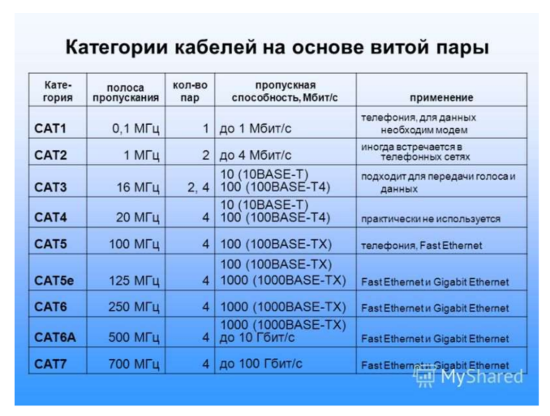

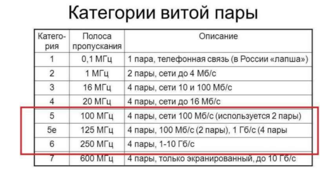
Часто термин «RJ-45» ошибочно употребляется для именования разъёма
8P8C, который используется для построения ЛВС; в то время, как стандарт RJ45 (точнее, RJ45S) использует разъём 8P4C с ключом, который физически
несовместим с разъёмом 8P8C. Ошибочное употребление термина «RJ-45»
вызвано, вероятно, тем, что стандарт RJ-45S не получил широкого
применения, а также внешним сходством разъёмов.

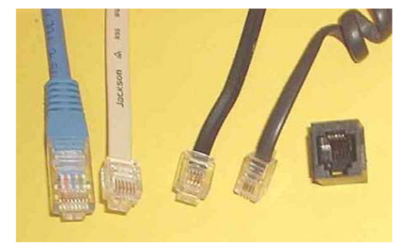
## Слева направо, виды штекеров:

* 8P8C — 8-контактный, используется «RJ-45», это основной штекер,
используемый при организации ЛВС;
* 6P6C — 6-контактный, используется RJ-25;
* 6P4C — 4-контактный, используется RJ-14, также часто используется
вместо 6P2C в RJ-11;
* 4P4C — 4-контактный, используется для подключения телефонных трубок
в «RJ-9».
* Средние два штекера (6P6C и 6P4C) могут быть вставлены в одну и ту же
стандартную 6-контактную розетку (крайняя справа).

В интернете путают RJ45 с коннектором 8P8C. То есть на самом деле
правильно называть именно 8P8C, а не RJ45. В частности, RJ 45 или
правильнее RJ45S имеет совсем другой вид и всего лишь 4 жилы, а
предназначен для подключения модемов.

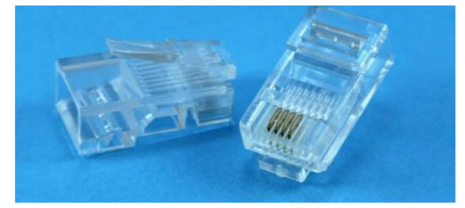
В итоге у нас есть 8P8C и RJ45S (8P4C), которые и путают между собой.
Скорее всего путать будут и дальше, так как название уже сильно прижилось
среди IT инженеров, системных администраторов и других специалистов,
которые занимаются сетевым оборудованием.

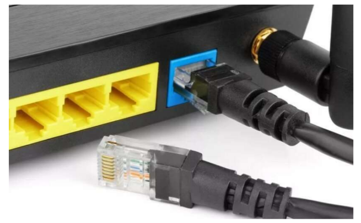
Проблема ещё в том, что в некоторых маршрутизаторах, коммутаторах
входы имеют название «RJ45», но как вы понимаете, это в корне не верно. Но
именно с помощью этого интерфейса и происходит подключение сетевых
устройств. Например, роутера и всех домашних устройств: компьютеров,
ноутбуков, телевизоров и т.д.

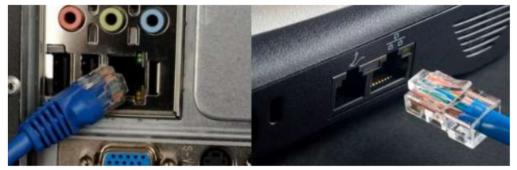
Также для подключения подобных коннекторов используется
специальный вида кабель – «Витая пара». Называется он так, потому что
внутри кабеля есть ещё 4 пары (8 штук) проводков, который скручены между
собой. Это необходимо, чтобы защитить передаваемые данные от
электромагнитного воздействия.

## Основные схемы обжимки

Данную схему часто называют «Компьютер – Компьютер», хотя на самом деле
её применяют для подключения: роутеров, свитчей, телевизоров, сетевых
принтеров и многих других сетевых устройств. В том числе её постоянно
используют для подключения интернета.
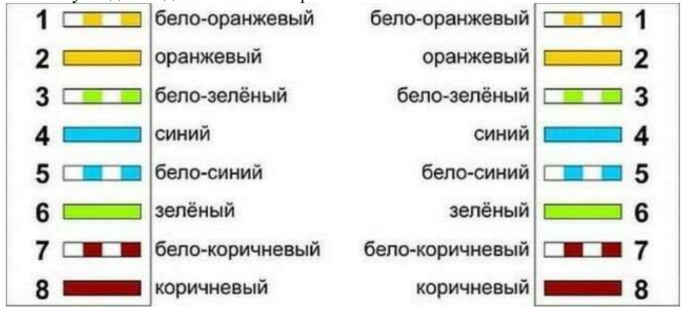

Почти везде при подключении используется именно «B» цветовая схема,
которая указана на картинке выше. Порядок обжимки Ethernet распиновки:
1. Бело-оранжевый.
2. Оранжевый.
3. Бело-зелёный.
4. Синий.
5. Бело-синий.
6. Зелёный.
7. Бело-коричневый.
8. Коричневый.

Нужно абсолютно одинаково обжать оба конца кабеля. Схема обжимки
достаточно простая.

• Снимаем верхнюю оплетку.
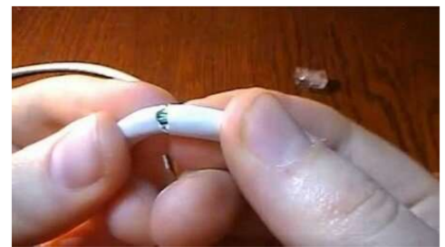

• Аккуратно располагаем все провода в нужном порядке, по схеме,
которая указана выше. Считаем слева на право от 1-го до 8-го провода.

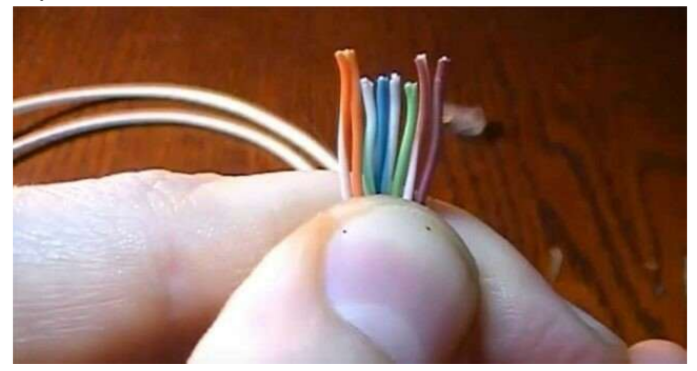
• Очень внимательно и аккуратно на глаз отрезаем лишнюю часть
проводов так, чтобы они были все на одном уровне.

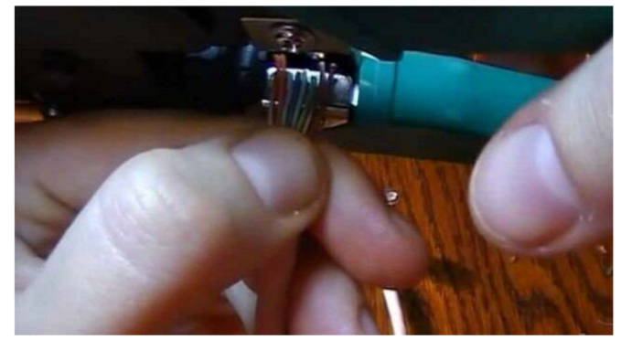
• Располагаем коннектор металлическими жилами вверх и аккуратно
вставляем проводки таким образом, чтобы каждый попал в свой
желобок.

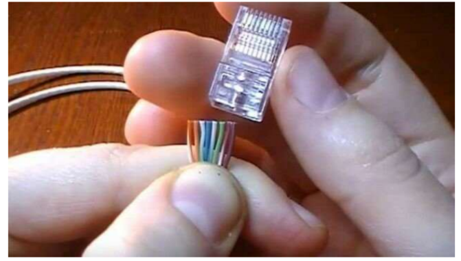
• Самое главное убедитесь, что каждый провод достает до металлических
жил коннектора, которые будут потом использоваться при «спайке».
Желательно, чтобы основная оплетка также была максимально внутри
самого коннектора. Далее берем щипцы для обжимки и один раз хорошо
их зажимаем.

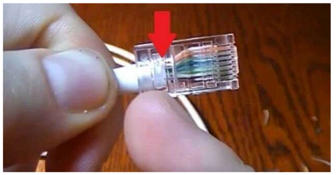
• Проделываем все вышеперечисленные пункты с другим концом.

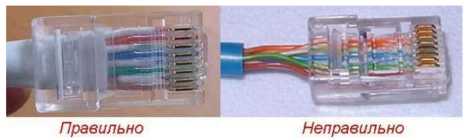
ПРИМЕЧАНИЕ! Коннектор RJ-45 – это неправильно название. На деле же
данного коннектора и вовсе не существует. Правильное название – 8P8C. Но
его почему-то путают с патч-кордом RJ45S, который имеет всего 4 жилы и
предназначен для подключения модемов. Но так как название уже вплотную
используется как в интернете, так и у сетевых инженеров, то менять его
никто не собирается. Да и звучит оно проще. Но знать об этом факте
должен каждый профессиональный инженер.
Есть также перекрестная схема «A» (кросс-овер),. Один конец
обжимается аналогично, а вот второй уже использует немного другую
цветовую схему витой пары.

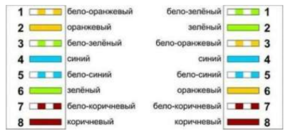
## Перекрестная распайка патчкорда по цветам
## «Ленивая обжимка» 2 пар

Как ни странно, но данную распиновку витой пары используют очень
часто, так как она достаточно простая. Если вы уже пытались хоть раз обжать
все 8 жил, то вы скорее всего сталкивались с некоторыми проблемами, когда
проводки загибаются, не попадают в нужный жёлоб, и в результате надо
начинать всё сначала. Данная схема используется только при подключении
устройств и сетевого оборудования, которому не нужно использовать скорость
выше 100 Мбит в секунду. При обжимке 4 пар сетевой кабель может
передавать данные со скоростью 1000 Мбит в секунду. Если же использовать
всего 2 пары, то скорость падает до 100. Конечно, в большинстве случаев таких
параметров достаточно, но с ростом скорости и потока обмена информацией в
организациях возможностей, обеспечиваемых данной распиновкой, не хватит

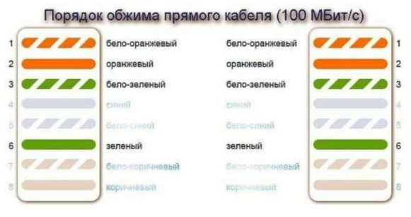
и потребуется переобжимать все кабели на обычную стандартную схему. В
итоге будет сделана двойная или даже лишняя работа. Тоже самое касается и
домашней сети при замене роутера 100 Мбит на новый с поддержкой 1 Гбит в
секунду. Если ранее была распиновка на 2 пары, то необходимо будет все
переобжимать. В худшем случае – замена 4-х жильного кабеля на 8-ми
жильный.

## Проверка подключения

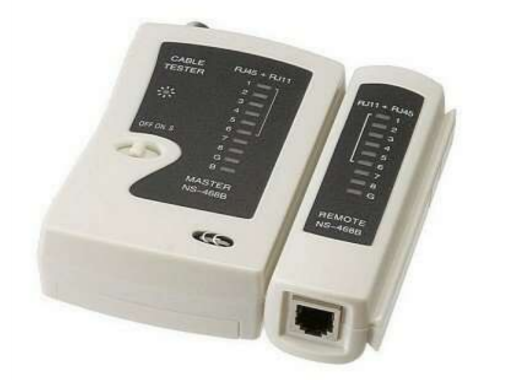
После обжима витой пары по выбранной схеме необходимо проверить
подключение. Для этого лучше всего использовать специальное устройство
LAN-тестер. Включаем устройство и подключаем к одному концу кабеля одну
часть аппарата, а вторую часть ко второму концу. Если индикаторы всех жил
просветились в правильно порядке – обжимка выполнена верно. Если какойто из индикаторов проводов не горит или мигнул неправильно – требуется
переобжимка кабеля.

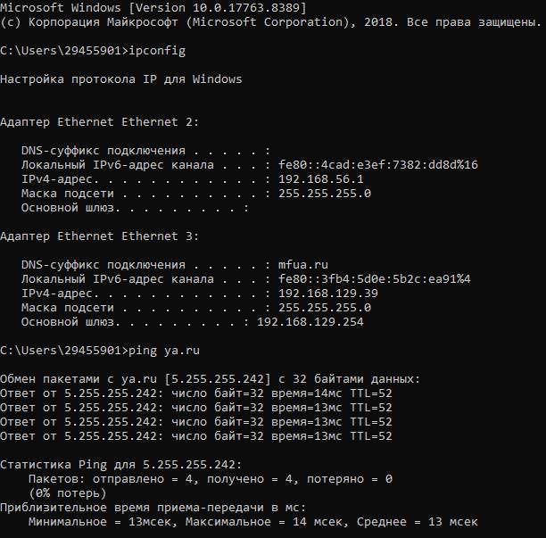

## Выполненная проверка

