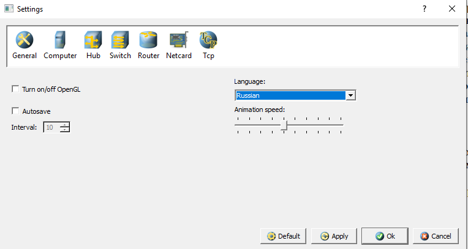
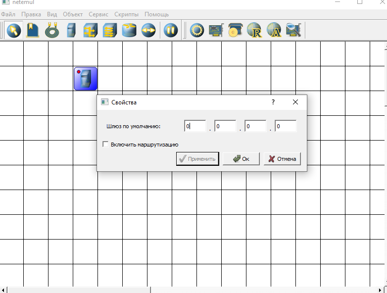
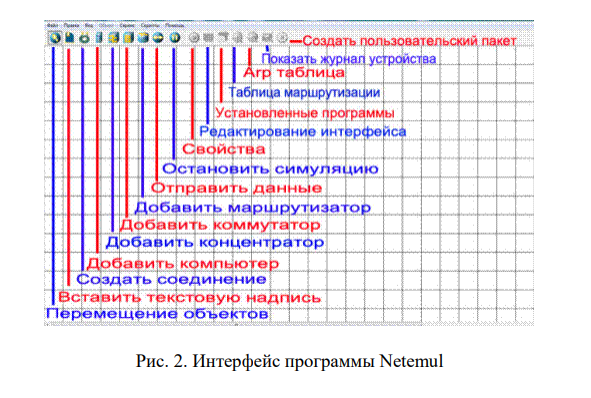
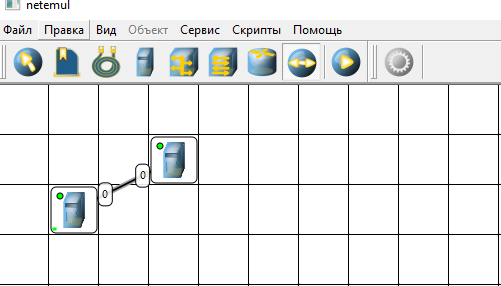
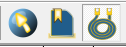
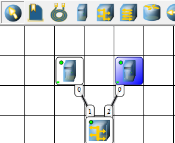
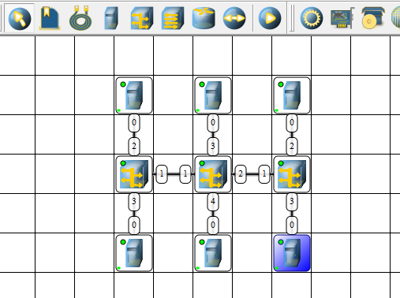

## Лабораторная работа №3 «Изучение программных средств для эмуляции компьютерных сетей»

Цель работы: приобретение знаний и практических навыков и использовании программного обеспечения для моделирования компьютерной сети.


Материалы, оборудование, программное обеспечение: лаборатория,
оснащенная персональными компьютерами, объединенными в локальную сеть
с доступом в Интернет, программа для моделирования компьютерных сетей
Netemul.


Критерии положительной оценки: выполнение типовых заданий,
оформление отчета по работе, ответы на вопросы для самопроверки.


Планируемое время выполнения:


Аудиторное время выполнения (под руководством преподавателя): 6
часов.


Время самостоятельной подготовки: 2 часа.

## Теоретическое введение
Практика в области сетевых технологий может проводиться как на
реальном, так и на виртуальном оборудовании. В первом случае имеются
явные преимущества, но требуются большие затраты на устройства и
расходные материалы. Второй процесс менее затратный, но требует
выбора программного обеспечения, наиболее полно удовлетворяющего
требованиям для проектирования, мониторинга или анализа
компьютерных сетей. Кроме того, данное программное обеспечение
можно использовать, когда затруднено решение проблем на реальных
сетях из-за риска нарушить их нормальное функционирование.
Существует два вида программ моделирования компьютерных сетей:
симуляторы и эмуляторы.
Симулятор – программное обеспечение, которое имитирует
топологию сети, состоящей из одного или нескольких сетевых устройств.
Моделируемые сетевые устройства не являются реальными устройствами
и не могут передавать «живой» сетевой трафик. Сетевые устройства в
симуляторе ограничены командами и функциями,
запрограммированными в них. В имитируемых аналогах может
отсутствовать ряд дополнительных возможностей, которые реализованы
на реальных сетевых устройствах. Достоинство симуляторов заключается
в том, что они, как правило, не требовательны к ресурсам.
Эмулятор – программное обеспечение, которое виртуализируют
реальные сетевые устройства с большим набором функций по сравнению
с устройствами, представленными в симуляторах. Виртуальные сетевые
устройства имитируют полнофункциональные устройства конкретных
производителей (Cisco, HP, Huawai и др.).
Программные симуляторы и эмуляторы являются удобным и
функциональным средством при проектировании и внедрении сетевых
решений, обеспечивая выбор наиболее оптимального варианта
моделирования.
Программа для моделирования компьютерных сетей NetEmul была
создана для визуализации работы компьютерных сетей и облегчения
понимания происходящих в ней процессов. Кроме обучения, программа
открывает широкие возможности для экспериментов и их наглядного
отображения.
NetEmul свободно распространяется по лицензии GPL, является
кроссплатформенной и может функционировать в операционных
системах: Windows, Linux, MacOS. Благодаря этому программа может
быть полезна как в учебных заведениях, использующих свободное ПО,
так и в домашних условиях.
Работа программы максимально приближена к модели работы
реальной сети, отображает реальные настройки, факторы и случайности,
происходящие в сети.
Скачать программу и получить подробную информацию о развитии
проекта можно по адресу https://sourceforge.net/projects/netemul.
Ссылка на обучающее видео «Практический материал: Эмулятор
сети Netemul» https://youtu.be/rUyQ4-vlw2w.

## Контрольные вопросы для самопроверки
Для моделирования компьютерных сетей существует множество программ, которые делятся на три основные категории: симуляторы, эмуляторы и специализированные инструменты для академических исследований. Выбор конкретного решения зависит от ваших целей: обучение, научная работа или подготовка к профессиональной сертификации.

|Характеристика|Симуляторы|Эмуляторы|
|-------|-----------------|----------|
|Принцип работы|Создают упрощенную математическую модель сети и протоколов. Работа устройств "имитируется".|Загружают реальные операционные системы (например, Cisco IOS) сетевых устройств и выполняют их код. "Копируют" работу реального оборудования.|
|Точность|Поведение устройств приблизительное, некоторые функции могут быть упрощены или отсутствовать.|Очень высокая, так как команды и протоколы работают точно так же, как на реальном оборудовании.|
|Требования к ресурсам|Низкие. Могут работать на стандартных компьютерах.|Высокие. Требуют мощный процессор и много оперативной памяти, особенно при создании больших топологий.|
|Где лучше использовать|Изучение общих принципов работы сетей, протоколов, моделирование загруженности сети.|Подготовка к профессиональным сертификациям (CCNA, CCNP), отработка реальных конфигураций, тестирование сложных сценариев.|

1. Cisco Packet Tracer (Симулятор)
- Кем используется: Начинающие специалисты, студенты Сетевой академии Cisco.
- Ключевые особенности: Идеален для обучения, имеет интуитивно понятный графический интерфейс, позволяет моделировать сети из устройств Cisco, ПК, серверов и IoT-устройств.
- Плюсы: Бесплатен, не требователен к ресурсам, очень нагляден.
- Минусы: Сильно упрощает многие процессы, его функционал ограничен и не подходит для серьезных исследовательских задач.

2. GNS3 (Эмулятор)
- Кем используется: Студенты старших курсов, сетевые инженеры, энтузиасты, готовящиеся к экзаменам CCNP/CCIE.
- Ключевые особенности: Самый популярный бесплатный эмулятор с открытым кодом. Поддерживает устройства Cisco, Juniper и др. Тесно интегрируется с Wireshark.
- Плюсы: Высокая точность работы (так как использует реальные IOS), огромное сообщество.
- Минусы: Сложен в первоначальной настройке, требует от пользователя знаний, очень требователен к ресурсам ПК.

3. EVE-NG (Emulated Virtual Environment - Next Generation)
- Кем используется: Профессиональные инженеры, преподаватели.
- Ключевые особенности: Мощная платформа, которая работает через веб-интерфейс. Позволяет создавать сложные лабораторные работы из тысяч устройств разных вендоров.
- Плюсы: Огромная масштабируемость, поддержка HTML5 (не требуется установка плагинов), удобное управление топологиями.
- Минусы: Есть платная версия для доступа к расширенным функциям.

4. NS-3 (Симулятор)
- Кем используется: Исследователи, аспиранты.
- Ключевые особенности: Дискретно-событийный симулятор, предназначенный для научных целей. Не поддерживает обратную совместимость с NS-2, пишется на C++ с привязками к Python.
- Плюсы: Максимальная гибкость и точность для исследовательских задач, открытый исходный код, огромное количество реализованных моделей протоколов.
- Минусы: Очень сложен для освоения, не имеет удобного графического интерфейса (всё делается через командную строку и скрипты).

5. Другие известные решения:
- Containerlab: Современный инструмент, который использует контейнеры Docker для быстрого развертывания сетевых лабораторий. Идеален для тестирования сетевых ОС, работающих в контейнерах (например, Nokia SR Linux, Arista cEOS).
- OMNeT++: Широко используется в академической среде для моделирования не только IP-сетей, но и сложных распределенных систем.
- Cisco Modeling Labs (CML): Платное профессиональное решение от Cisco, пришедшее на смену VIRL. Обеспечивает высокую точность и масштабируемость.

# 2. Что такое IP-адрес?

IP-адрес (Internet Protocol Address) — это уникальный цифровой «пропуск» или «адрес проживания» вашего устройства в компьютерной сети (интернет или локальная сеть).

Благодаря этому адресу компьютеры, серверы и другие устройства понимают, куда отправлять запрашиваемую информацию (веб-страницы, фильмы, фото) и от кого пришел ответ.

Можно провести аналогию с почтой:
- Ваш домашний адрес (Город, Улица, Дом, Квартира) — это IP-адрес.
- Почтовое отделение (маршрутизаторы/роутеры) — сервисы, которые знают, как доставить письмо по адресу.
- Письмо — это пакет данных (часть картинки, видео или текста).

Существует две основных версии протокола, поэтому адреса выглядят по-разному:

1. IPv4 (Самая распространенная версия, 4.3 миллиарда адресов)
Это классический вид, который вы чаще всего видите. Он состоит из 4 чисел от 0 до 255, разделенных точками.
- Пример: ``` 192.168.1.1 ```, ``` 87.250.250.242 ``` (это адрес Яндекса).
- Проблема: Всего существует около 4,3 миллиардов уникальных IPv4-адресов (например, 176.15.88.42). Из-за бума интернета вещей их стало не хватать.

2. IPv6 (Новая версия для замены, адресов хватит на всех)
Он пришел на смену IPv4, чтобы в мире хватило адресов для каждого смартфона, холодильника и автомобиля. Выглядит как длинная строка из букв и цифр (шестнадцатеричная система).

- Пример: ``` 2001:0db8:85a3:0000:0000:8a2e:0370:7334 ```

|Тип|Внешний IP (Public)|Внутренний IP (Private)|
|-------|-----------------|----------|
|Где используется|В глобальном интернете. Назначается провайдером вашему роутеру.|В локальной сети (ваша квартира, офис). Назначается роутером вашему телефону, ноутбуку, ТВ.|
|Уникальность|Уникален во всем мире.|Повторяется в каждой квартире/офисе (например, в каждой квартире есть свой 192.168.1.1).|
|Для чего нужен|Чтобы сервера в интернете знали, куда отправлять ответ.|Чтобы устройства внутри дома общались друг с другом и с роутером.|

Как это работает: Провайдер дает один Внешний IP на ваш дом. Роутер раздает Внутренние IP всем вашим гаджетам. Когда вы выходите в интернет, роутер подменяет адреса и запоминает, кому что отправить обратно. Это называется NAT (Преобразование сетевых адресов).

Динамический и Статический IP
- Динамический IP (Dynamic): Адрес, который автоматически меняется время от времени (например, после перезагрузки роутера). Это стандарт для домашних тарифов — дешево и безопасно.
- Статический IP (Static): Постоянный адрес, который не меняется годами. Обычно подключается за отдельную плату у провайдера. Нужен, если вы хотите иметь дома свой сервер, видеонаблюдение или доступ к рабочему ПК извне.

# Как узнать свой IP-адрес?

1. Внутренний адрес (в сети вашего роутера): Зайдите в настройки сети в Windows или macOS.
2. Внешний адрес (в интернете): Просто введите в поиск Яндекса или Google запрос "Мой IP-адрес". Сервис мгновенно покажет его.

# Зачем это все нужно знать?

Понимание IP-адресов помогает решать бытовые задачи:
- Настроить игровой сервер у себя дома (понадобится статический IP или проброс портов).
- Настроить роутер (вбить в браузере адрес ``` 192.168.0.1 ``` или ``` 192.168.1.1 ```).
- Понять, почему в локальной сети "нет доступа к интернету" (скорее всего, роутер не выдал IP).
- Обеспечить базовую безопасность (через IP-адрес можно примерно определить геолокацию пользователя).

# 3. Что такое маска подсети?

Маска подсети — это правило или трафарет, который помогает компьютеру и сетевому оборудованию понять: какая часть IP-адреса отвечает за адрес всей сети (как улица или город), а какая — за уникальный адрес устройства (как номер дома) внутри этой сети.

Если IP-адрес — это конкретный «номер дома», то маска подсети определяет границы района: «где заканчивается ваша улица и начинаются чужие кварталы».

# Зачем она нужна?

Интернет устроен так: данные не летят напрямую от компьютера к компьютеру. Сначала пакет отправляется в «свою» локальную сеть (к роутеру). Роутер смотрит на маску и решает:

1. Если адрес получателя находится в той же сети (по правилам маски) — отправить пакет напрямую.
2. Если адрес получателя из другой сети — отправить пакет выше (главному шлюзу, провайдеру), чтобы тот искал дальше.

Без маски устройство не отличит соседа по этажу от компьютера на другом конце Земли.

# Как это выглядит?

Маска пишется так же, как IP-адрес: четыре числа от 0 до 255, разделенные точками.
Пример: ``` 255.255.255.0 ```

Но главное в маске — не цифры, а сколько в ней первых единиц. Единицы описывают ту самую «общую часть» (адрес сети), а нули — «уникальную часть» (адрес устройства).

Наглядный пример (бинарный код)

Представьте IP-адрес ``` 192.168.1.5 ``` и маску ``` 255.255.255.0 ```:

|Значение|Первая часть|Вторая часть|Третья часть|Четвертая часть|
|-------|------|------|--|--|
|IP-адрес|192|168|1|5|
|Маска подсети|255|255|255|0|
|Что означают 255|Сеть (улица)|Сеть (улица)|Сеть (дом)|0 — это место для номера квартиры|

Результат: Все устройства, у которых первые три числа совпадают (``` 192.168.1.xxx ```), находятся в одной сети. Они видят друг друга напрямую. А устройство с адресом ``` 192.168.2.5 ``` — это уже другая сеть.

# Как записывают маску (Форматы)

Существует два популярных способа записи одной и той же маски:
1. Полный (десятичный): ``` 255.255.255.0 ```
2. Сокращенный (префиксный, CIDR): Просто пишут косую черту и количество единичных битов. Например, ``` /24 ```.
``` 255.255.255.0 ``` = ``` /24 ``` (потому что 8 бит + 8 бит + 8 бит = 24 единицы).

|Полная маска|Сокращение (CIDR)|Количество устройств|Класс сети|Где встречается|
|-|-|-|-|-|
|255.0.0.0|/8|~16,7 млн|Класс A|Гигантские сети (как у Google)|
|255.255.0.0|/16|~65 тыс.|Класс B|Крупные компании, университеты|
|255.255.255.0|/24|254|Класс C|Домашние и офисные сети|
|255.255.255.128|/25|126|-|Чтобы разбить сеть на две части|
|255.255.255.192|/26|62|-|Для Wi-Fi гостевых зон|

Почему 254, а не 256? Из пула адресов всегда вычитают 2 служебных адреса: первый (сам IP сети) и последний (широковещательный).

# При чем здесь адрес сети и broadcast?

Когда вы наложили маску на IP, вы получаете три важных сущности:
1. IP-адрес устройства: ``` 192.168.1.5 ```
2. Адрес сети: ``` 192.168.1.0 ``` (это имя самого района / улицы).
3. Broadcast-адрес: ``` 192.168.1.255 ``` (специальный адрес для команды «Всем встать в строй!»).

# Почему это важно знать обычному пользователю?

1. Настройка роутера: При ручном вводе IP (статический адрес) вы обязаны правильно указать маску (обычно ``` 255.255.255.0 ```), иначе интернет не будет понимать, с кем вы рядом, а с кем — далеко.
2. Объединение сетей: Если у вас ноутбук с адресом ``` 192.168.1.10 ``` не видит принтер с адресом ``` 192.168.2.10 ``` — посмотрите на маску. Скорее всего, она ``` 255.255.255.0 ```. Этим устройствам кажется, что они живут на разных улицах. Чтобы они увидели друг друга, нужно сменить маску на ``` 255.255.0.0 ``` (объединить улицы в район).
3. Диагностика: Команда ``` ipconfig ``` (Windows) или ``` ifconfig ``` (Linux/Mac) показывает вашу маску. Если вы видите ``` 0.0.0.0 ``` в графе маски — адрес не получен, сети нет.

# 4. Как работает концентратор?

Концентратор (он же hub, от англ. hub — центр деятельности) — это устройство, которое можно назвать «глупым разветвителем» для сети. Он практически вышел из употребления, но понимать его принцип полезно, чтобы оценить эволюцию сетей (Hub → Switch → Router).

Простыми словами: Концентратор — это повторитель сигнала. Он получает данные от одного устройства и просто рассылает их всем остальным, кто к нему подключен.

# Принцип работы (Кто крикнул, тот и услышал)

Работа концентратора очень похожа на рацию или античный чат:
1. Доставка пакета: Компьютер А отправляет пакет данных (например, «Открой файл») на свой сетевой кабель.
2. Прием и Повтор: Концентратор получает этот сигнал на одном из своих портов.
3. Ретрансляция (Flooding): Не глядя на адрес, Hub тупо копирует сигнал и отправляет его на ВСЕ остальные порты (кроме того, с которого пришла информация).
4. Шум в эфире: Все устройства в сети (компьютеры Б, В и Г) получают этот пакет.
5. Фильтрация: Каждый компьютер смотрит: «А это мне?».
- Если в пакете указан MAC-адрес компьютера В — молчат все, кроме компьютера В.
- Если адрес не совпал — компьютер молча игнорирует пакет.

Итог: Это как если бы вы отправили письмо по почте, но почтальон снял копию и вручил её всем жильцам вашего подъезда, чтобы они сами решили, им это письмо или соседу.

# Главные недостатки (Почему Hubs — "динозавры")

В современных реалиях концентраторы не используются из-за трех фатальных проблем:
1. Постоянные коллизии (Драка за кабель)
Представьте, что два человека в одной комнате начали говорить одновременно. В сети это называется коллизия. Данные искажаются, и приходится пересылать их заново. Чем больше устройств в хабе, тем больше коллизий и тем ниже реальная скорость.
2. Низкая безопасность (Общий эфир)
Поскольку данные видны всем, любой пользователь в сети (или злоумышленник) может включить сниффер (перехватчик трафика) и читать чужие письма, пароли и файлы. В коммутируемой сети (Switch) это сделать гораздо сложнее.
3. Неполный дуплекс (Half-Duplex)
Устройства не могут одновременно отправлять и принимать данные. Пока ты говоришь — ты не слышишь собеседника.

# Наглядная схема работы
Передача файла с Компьютера A на Компьютер C через Концентратор (Hub):
- A -> Hub: "Передаю данные для C".
- Hub -> B: "Данные для C" (B игнорирует).
- Hub -> C: "Данные для C" (C принимает).
- Hub -> D: "Данные для C" (D игнорирует, но видит содержимое).

Тоже самое на Коммутаторе (Switch): Коммутатор отправляет данные только в порт C. Остальные компьютеры даже не знают, что передача шла.

# Почему тогда концентраторы вообще существовали?

1. Дешевизна: Раньше они стоили существенно дешевле коммутаторов.
2. Простота: Не требует настройки (plug-and-play).
3. Пассивный мониторинг: Из-за того, что все данные видны всем, хаб иногда использовали для отладки сетей (подключали анализатор и смотрели весь трафик).

# 5. Какие особенности обмена данными в ЛВС на основе концентраторов?

Сеть на концентраторе — это единая «столбовая дорога» или, как говорят инженеры, общая разделяемая среда передачи.

Вот ключевые особенности обмена данными в такой ЛВС:

1. Полудуплексный режим (Half-Duplex)

Это самая важная особенность. В такой сети устройства не могут одновременно передавать и принимать данные.

- Аналогия: Это как переговоры по рации или старому дисковому телефону. Пока вы говорите, вы не слышите собеседника. Чтобы услышать ответ, нужно замолчать.
- Технически: Если два устройства попытаются передать данные одновременно, произойдет коллизия.

2. Коллизии и CSMA/CD (Метод доступа)

Поскольку все устройства «кричат» в один кабель, нужны правила. ЛВС на концентраторе используют протокол CSMA/CD (Carrier Sense Multiple Access with Collision Detection — множественный доступ с контролем несущей и обнаружением коллизий). Алгоритм выглядит так:
- Перед тем как говорить (Carrier Sense): Устройство слушает, нет ли в сети передачи. Если есть — ждет.
- Говорит: Если тихо — начинает передачу.
- Обнаружение коллизии (Collision Detection): Во время передачи устройство продолжает слушать. Если оно слышит, что сигнал в кабеле исказился (началась коллизия), оно понимает, что кто-то заговорил одновременно.
- Шум (Jam): Все устройства отправляют специальный сигнал «Шум», чтобы оповестить всех о коллизии.
- Пауза и повтор: Каждое устройство ждет случайный промежуток времени (от микросекунд до секунды) и пробует передать снова.

Следствие: Чем больше устройств в сети и чем интенсивнее трафик, тем больше коллизий и тем реальная скорость падает (иногда до нуля).

3. Пропускная способность делится на всех (Время ожидания)

Это главный «убийца» производительности.

- Если у вас концентратор на 100 Мбит/с и подключено 5 компьютеров, общая скорость делится между ними. Но не равномерно, а ситуативно.
- Пока один компьютер передает данные, остальные вынуждены молчать (их очереди ждут). При активной работе нескольких машин сеть сильно тормозит.

4. Нет никакой безопасности (Общий эфир)

Это фатальная особенность для современных реалий. Концентратор работает на физическом уровне. Он не понимает MAC-адресов. Его задача: пришел сигнал — отправил по всем портам.

- Что это значит: Все данные, которые передает любой компьютер, видны абсолютно всем подключенным устройствам (другим компьютерам, принтерам).
- Угроза: Злоумышленник может включить на своем ПК режим «прослушки» (сниффер) и читать чужие письма, пароли, просматривать файлы, которые передаются по сети. В современной сети на коммутаторе (Switch) так сделать без дополнительных атак (ARP-spoofing) невозможно.

5. Ограниченный размер сети (Правило 5-4-3)

Из-за затухания сигнала и особенности работы коллизий, сеть на концентраторах имеет жесткое ограничение по длине и количеству устройств (правило «двойного» или «пяти» сегментов).

- Нельзя бесконечно соединять концентраторы друг с другом. Время распространения сигнала ограничено. Если сеть слишком большая, детектор коллизий перестает работать корректно, и сеть «падает» из-за бесконечных коллизий.

6. Простота и дешевизна (Единственные плюсы, но исторические)

- Plug-and-Play: Не нужно настраивать абсолютно ничего.
- Дешево: Стоили копейки по сравнению с коммутаторами.
-Отсутствие задержек: Данные передаются без буферизации (обработки) или с минимальной заводской паузой.

## Задание к лабораторной работе
Студент получает типовые задания на выполнение работы по
моделированию.
Методические указания и порядок выполнения работы
1. Ознакомиться с функциональными возможностями программного
обеспечения для моделирования компьютерной сети.
2. Выполнить типовые задания с сохранением результатов моделирования
в файле определенного формата (.net).
3. Полученные результаты занести в отчет по лабораторной работе.
## Задание 1. Изучение интерфейса программы

Приложение позволяет создавать сети без каких-либо ограничений.
Верхняя панель инструментов содержит значки всех объектов, которые можно
разместить в рабочей области. Выбор объекта и его размещение в сетке
рабочей области выполняется стандартными манипуляциями с компьютерной
мышью. Объектами могут быть компьютеры, концентраторы, коммутаторы,
маршрутизаторы, соединительные кабели и текстовые поля для ввода надписи
или комментария.
После выбора и размещения объектов выполняется настройка
соединений, перетаскиванием линий от одного объекта к другому. Все
необходимые для построения сети инструменты, а также кнопки Отправки
сообщений и Запустить/Остановить размещены на Панели устройств. При
корректном соединении устройств на каждом конце соединения показан
номер используемого интерфейса, а на иконке устройства индикатор
соединения меняет цвет с красного на желтый (соединение есть, но
интерфейсы не настроены). На Панели параметров расположены свойства
объектов. Для выделенного объекта появляются только те свойства, которые
характерны для него. Настройку параметров работы конкретного узла можно
выполнить в контекстном меню (нажатие правой кнопки мыши на значке
узла).
Завершенный проект сети может быть напечатан или сохранен в
определенном формате (.net) для последующего использования.
Для проведения анализа работы сети в приложении возможно присвоение
адресов всем объектам, отправление пакетов данных с одного компьютера на
другой, определение пути и скорости передачи данных.
В меню программы Помощь приведено подробное руководство
пользователя.


## Выполнение задания
1. Установить программу Netemul.
2. Запустить и русифицировать интерфейс командой Сервис-Настройки
(Рисунок 1)


## Рис. 1. Русификация интерфейса программы

2. Выполнить описанные ранее действия по ознакомлению с интерфейсом
(Рисунок 2).




## Задание 2. Непосредственное объединение в сеть двух компьютеров Рассмотреть простейший случай организации сети из двух компьютеров без использования сетевого коммутационного оборудования.

## Выполнение задания
1. Выполнить команду Файл-Новый, чтобы нарисовать схему сети как
показано на Рисунке 3.



Рис. 3. Схема компьютерной сети и ее модели в Netemul
2. Добавить на рабочее поле эмулятора два компьютера (кнопка
«Добавить компьютер» на панели инструментов).

3. Соединить компьютеры (кнопка «Создать соединение» на панели
инструментов) и подтвердить соединение между интерфейсами eth0 и eth0
нажатием «Соединить» (Рисунок 4).



Рис. 4. Инструмент создания соединений сетевых устройств
3. Корректное выполнение действий подтверждается показом номера
используемого интерфейса на концах соединения (в данном случае 0) и
изменением цвета индикатора на значках компьютеров с красного на желтый
(соединение установлено, но не настроено).
4. Через пункт «Интерфейсы» контекстного меню настроить сетевые
интерфейсы компьютеров:
- в открывшемся окне в соответствующих полях указать IP-адрес и маску
подсети (после указания адреса маска появляется автоматически);
- подтвердить ввод последовательным нажатием кнопок «Применить» и
«ОК».
При настройке интерфейсов необходимо помнить, что компьютеры
должны находиться в одной сети (подсети), что обеспечивается выбором
сетевого адреса и маски подсети. Для локальной сети используются частные
IP-адреса (англ. private IP address), также называемые внутренними,
внутрисетевыми или локальными — IP-адресами, которые принадлежат к
специальному диапазону, не используемому в сети Интернет. Такие адреса
предназначены для применения в локальных сетях, распределяются и
контролируются сетевыми администраторами. В работе рекомендуется
использовать сетевые адреса 192.168.0.X (X -номер компьютера) с маской
подсети 255.255.255.0.
5. Корректное выполнение пункта 4 подтверждается изменением цвета
индикаторов на значках компьютеров с желтого на зеленый (соединение есть
и интерфейсы настроены).
6. Для каждого компьютера вставить текстовую надпись (Рисунок 1) с его
именем, IP-адресом и маской подсети в короткой форме (для 255.255.255.0
соответственно /24).
7. Проверить работоспособность смоделированной сети передачей
пакетов данных между компьютерами:
- на панели инструментов выбрать инструмент «Отправить данные». Под
курсором на рабочем поле появится красный круг, которым указать
передающий компьютер;
- в открывшемся окне «Отправка» указать: протокол TCP, размер данных
5 KB;

- нажать «Далее» и после появления зеленого круга под курсором указать
принимающий компьютер;
- в открывшемся окне подтвердить интерфейс eth0 на принимающем
компьютере, нажав «Отправка»;
- наблюдать перемещение пакетов.
- проекты сохранить для отчета.


## Задание 3. Моделирование сети из двух ПК и концентратора
1. Выполнить команду Файл-Новый, чтобы нарисовать схему сети как
показано на Рисунке 5.
2. Добавить на рабочее поле два компьютера и концентратор, соединить
устройства, как показано на Рисунке 5, настроить сетевые интерфейсы
компьютеров, задав IP-адреса и маски подсети, добавить рядом с
устройствами соответствующие надписи.
3. Проверить работоспособность смоделированной сети, передав пакеты
данных (TCP, 5KB) между компьютерами.
4. Проследить за перемещением пакетов и сделать выводы об
особенностях работы компьютерной сети с концентратором.



Рис. 5. Схема сети из двух ПК и концентратора

## Задание 3. Моделирование ЛВС на концентраторах
1. Выполнить команду Файл-Новый, чтобы нарисовать схему сети как
показано на Рисунке 6.



Рис. 6. Схема сети и ее модели на основе концентраторов
2. Добавить на рабочее поле шесть компьютеров, три концентратора и
соединить устройства как показано на рисунке 6.
3. Настроить сетевые интерфейсы компьютеров, задав IP-адреса и маски
подсети.
4. Проверить работоспособность смоделированной сети, передав пакеты
данных (TCP, 5KB) между компьютерами.
5. Проследить за перемещением пакетов и сделать выводы об
особенностях работы ЛВС на основе концентраторов.
6. Проекты сохранить для отчета.

## Требования к отчету и защите

В отчете указываются название, цель работы. Описание выполненных
лабораторных заданий с результатами в виде скриншотов, сохраненных
результатов моделирования в файле формата (.net) и выводами по каждому
заданию.
На защите проверяются приобретенные знания теоретического и
практического материала с демонстрацией результатов моделирования и по
ответам на контрольные вопросы для самопроверки.
