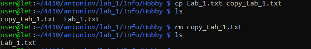

## Лабораторная работа № 1 Командная строка Windows
## Цель работы: Развитие профессиональных навыков работы в командной строке Windows.

## Задачи работы:

- Создание структуры каталогов;
- Создание, просмотр, редактирование, удаление файлов;
- Удаление структуры каталогов;
- Манипулирование операционной системой Windows с помощью командной строки.

## Задание на лабораторную работу
Загрузить командную строку (Пуск – Программы –
Стандартные – Командная строка).
1. В каталоге Temp создать дерево каталогов по
вариантам как показано в вариантах заданий с использованием
команд табл. 1.

2. В каталоге А2 создать подкаталоги В4 и В5 и удалить
каталог В2.

3. В каталоге Personal создать файл Name.txt,
содержащий информацию о фамилии, имени и отчестве
студента. Здесь же создать файл Date.txt, содержащий
информацию о дате рождения студента. В этом же каталоге
создать файл School.txt, содержащий информацию о школе,
которую закончил студент.

4. В каталоге University создать файл Name.txt,
содержащий информацию о названии вуза и специальность, на
которой студент обучается. Здесь же создать файл Mark.txt с
оценками на вступительных экзаменах и общей суммой баллов.

5. В каталоге Hobby создать файл hobby.txt с
информацией об увлечениях студента.

6. Скопировать файл hobby.txt в каталог А2 и
переименовать его в файл Lab_№варианта.txt.

 

7) Сделать копию файла Lab_№варианта.txt (например,
copy_Lab_№варианта.txt ) в этом же каталоге и удалить его.

8) Очистить экран от служебных записей.

9) Вывести на экран поочередно информацию,
хранящуюся во всех файлах каталога Personal.

10) Отсортировать все файлы, хранящиеся в каталоге
Personal, по имени.

## Не работает

11) Объединить все файлы, хранящиеся в каталоге
Personal, в файл all.txt и вывести его содержимое на экран.

12) Отредактировать файл all.txt, добавив в него год
вашего рождения, и вывести его содержимое на экран.

13) Скопировать файл all.txt в директорию А1.

14) Удалить все директории, в названии которых есть
буква A или цифра 2.
15) Изменить строку приглашения в соответствии с
номером варианта.

