## Лабораторная работа № 1 Командная строка Windows
## Цель работы: Развитие профессиональных навыков работы в командной строке Windows.

## Задачи работы:

- Создание структуры каталогов;
- Создание, просмотр, редактирование, удаление файлов;
- Удаление структуры каталогов;
- Манипулирование операционной системой Windows с помощью командной строки.

## Задание на лабораторную работу
Загрузить командную строку (Пуск – Программы –
Стандартные – Командная строка).
1. В каталоге Temp создать дерево каталогов по
вариантам как показано в вариантах заданий с использованием
команд табл. 1.

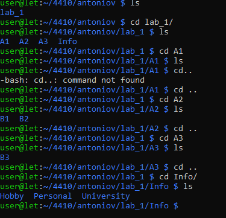

2. В каталоге А2 создать подкаталоги В4 и В5 и удалить
каталог В2.

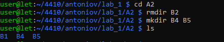

3. В каталоге Personal создать файл Name.txt,
содержащий информацию о фамилии, имени и отчестве
студента. Здесь же создать файл Date.txt, содержащий
информацию о дате рождения студента. В этом же каталоге
создать файл School.txt, содержащий информацию о школе,
которую закончил студент.

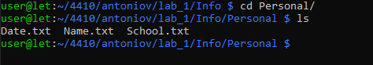

4. В каталоге University создать файл Name.txt,
содержащий информацию о названии вуза и специальность, на
которой студент обучается. Здесь же создать файл Mark.txt с
оценками на вступительных экзаменах и общей суммой баллов.

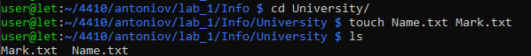

5. В каталоге Hobby создать файл hobby.txt с
информацией об увлечениях студента.


6. Скопировать файл hobby.txt в каталог А2 и
переименовать его в файл Lab_№варианта.txt.

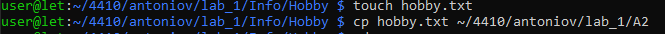 

7) Сделать копию файла Lab_№варианта.txt (например,
copy_Lab_№варианта.txt ) в этом же каталоге и удалить его.


8) Очистить экран от служебных записей.


9) Вывести на экран поочередно информацию,
хранящуюся во всех файлах каталога Personal.

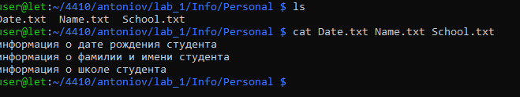

10) Отсортировать все файлы, хранящиеся в каталоге
Personal, по имени.

## Не работает

11) Объединить все файлы, хранящиеся в каталоге
Personal, в файл all.txt и вывести его содержимое на экран.

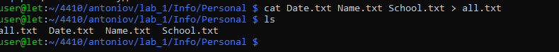

12) Отредактировать файл all.txt, добавив в него год
вашего рождения, и вывести его содержимое на экран.

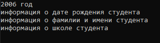

13) Скопировать файл all.txt в директорию А1.

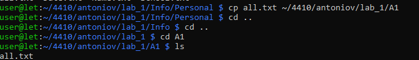

14) Удалить все директории, в названии которых есть
буква A или цифра 2.
15) Изменить строку приглашения в соответствии с
номером варианта.

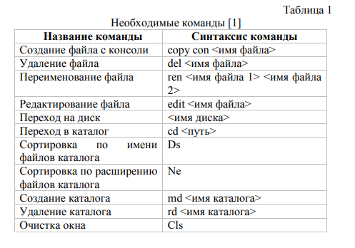
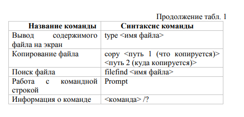
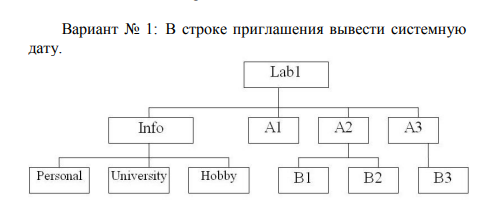


## Контрольные вопросы

# 1. Что такое командная строка?

Простыми словами, командная строка (или терминал) — это способ управления компьютером с помощью текстовых команд, а не кликов мышкой по картинкам.

Если графический интерфейс (рабочий стол с окнами и кнопками) — это "общение жестами", то командная строка — это разговор с компьютером на его командном языке. Вы пишете слово или фразу, нажимаете Enter, а компьютер выполняет действие и выводит ответ текстом.

## Как это выглядит?

Вы открываете специальную программу (например, ``` cmd ``` в Windows или ``` Терминал ``` в macOS/Linux) и видите черный (или белый) экран с текстом.

Обычно там написано что-то вроде:
``` C:\Users\Имя_Пользователя> ```

## Зачем она нужна, если есть удобная мышка?

Для обычного просмотра фильмов и игр она и не нужна. Но командная строка незаменима в трех случаях:

1. Для тонкой настройки и скрытых возможностей: Многие продвинутые настройки Windows или macOS вообще не отображаются в менюшках. Их можно изменить только введя точную текстовую команду (например, восстановить загрузчик Windows, изменить скрытые параметры сети или энергопотребления).

2. Для автоматизации рутины: Если вам нужно каждый день переименовывать 100 файлов, вручную кликать мышкой — час работы. А в командной строке можно написать одну строчку (например, ``` ren *.txt *.bak ```), которая сделает всё за секунду. Скрипты (пакетные файлы .bat) позволяют полностью автоматизировать действия.

3. Для администраторов и разработчиков: Сервера (на которых работают сайты и приложения) часто не имеют графического интерфейса. Чтобы управлять ими удаленно, нужно уметь пользоваться командами. Программисты тоже постоянно используют командную строку для компиляции кода, управления версиями (Git) или запуска серверов.

# 2. Перечислите основные команды управления файлами в командной строке.

|Что сделать|Графически (мышкой)|В командной строке|
|-|-|-|
|Посмотреть содержимое папки|Дважды кликнуть по папке|``` dir ```|
|Создать папку|Правая кнопка -> Создать -> Папку|``` mkdir НоваяПапка ```|
|Узнать свой IP-адрес|Пройти кучу меню настроек сети|``` ipconfig ``` (видно сразу)|
|Скопировать файл|Ctrl+C, Ctrl+V|``` copy file1.txt D:\ ```|
|Узнать, работает ли сайт|Попытаться открыть в браузере|``` ping google.com ```|
|Выключить компьютер через 5 минут|Кликать по кнопке "Пуск"|``` shutdown /s /t 300 ```|

## Как открыть командную строку (Windows 10/11)
1. Нажмите ``` Win + R ``` (Пуск -> Выполнить).
2. Напечатайте ``` cmd ``` и нажмите Enter.
3. Важно: Для некоторых команд нужны права администратора. Нажмите ``` Win ```, наберите ``` cmd ```, нажмите правой кнопкой мыши на значке и выберите «Запуск от имени администратора».

# 3. Перечислите команды вывода основной информации системы.

## Ниже приведен список основных команд для получения информации о системе в Windows (CMD/PowerShell) и Linux/macOS (Bash/Terminal).

|Команда|Что делает|Пример вывода|
|-|-|-|
|``` systeminfo ```|Самая полная информация: версия ОС, производитель, модель BIOS, объем RAM, дата установки, сетевые адаптеры, кол-во подключений.|*Список из 50+ строк о системе*|
|``` systeminfo ``` ``` findstr /B /C:"OS Name" /C:"Total Physical Memory" ```|Отфильтрованный ``` systeminfo ```: только Название ОС и объем ОЗУ.|``` OS Name: Microsoft Windows 11 Pro ```|
|``` hostname ```|Отображает сетевое имя компьютера в сети.|``` DESKTOP-ABC123 ```|
|``` whoami ```|Показывает имя текущего пользователя и домен/компьютер.|``` DESKTOP-ABC1\John ```|
|``` ipconfig ```|Базовая информация о всех сетевых адаптерах (IP-адрес, Маска подсети, Основной шлюз).|IPv4 Address: 192.168.1.10|
|``` ipconfig /all ```|Развернутая сетевая информация: MAC-адрес (Physical Address), DNS-сервера, включен ли DHCP, статус адаптера.|*Physical Address: 00-1A-2B-3C-4D-5E*|
|``` driverquery ```|Список всех установленных драйверов (имя, тип, дата).|*Список из 150+ драйверов*|
|``` wmic os get Caption, Version, InstallDate ```|Коротко: Название ОС, Версия, Дата установки.|``` Microsoft Windows 11 Pro 10.0.22000 20230315 ```|
|``` wmic cpu get name ```|Модель процессора.|``` Intel(R) Core(TM) i7-8700K ```|
|``` wmic memorychip get capacity, speed ```|Объем (в байтах) и скорость каждой планки ОЗУ.|Capacity: 8589934592, Speed: 3200|

## В Linux / macOS (Терминал)

|Команда|Что делает|Пример вывода|
|-|-|-|
|``` uname -a ```|Базовая информация о ядре: название ядра, имя хоста, версия ядра, архитектура (x86_64, arm).|Работает везде (Linux, macOS, BSD).|
|``` hostname ```|Имя компьютера в сети.|Linux / macOS.|
|``` whoami ```|Текущий пользователь.|Linux / macOS.|
|``` lsb_release -a ```|Информация о дистрибутиве Linux (Ubuntu, Debian, Fedora).|Только Linux (если установлен ``` lsb-release ```).|
|``` cat /etc/os-release ```|Более универсальный способ узнать дистрибутив Linux (работает почти везде).|Только Linux.|
|``` sw_vers ```|Информация о версии macOS (ProductName, ProductVersion, BuildVersion).|Только macOS.|
|``` system_profiler SPHardwareDataType ```|Полный отчет о железе Mac: модель, процессор, ОЗУ, серийный номер.|Только macOS.|
|``` lscpu ```|Детально о процессоре (архитектура, кол-во ядер/потоков, частота).|Только Linux.|
|``` free -h ```|Объем ОЗУ и Swap (подкачки) в удобном формате (GB/MB).|Linux / macOS.|
|``` df -h ```|Свободное место на дисках и разделах.|Linux / macOS.|
|``` ip a ``` (или ``` ip addr ```)|Вся информация о сетевых интерфейсах (IP, MAC, статус). Современная замена ``` ifconfig. ```|Только Linux.|
|``` ifconfig ```|Классическая сетевая информация (работает на Linux и macOS).|На Linux может требовать установки ``` net-tools ```.|
|``` nproc ```|Показывает количество доступных процессорных ядер.|Linux / macOS.|

## Универсальные команды (работают везде)

|Команда|Где работает|Что делает|
|-|-|-|
|``` echo %OS% ```|Windows (CMD)|Показывает тип ОС (например, ``` Windows_NT ```).|
|``` $env:OS ```|Windows (PowerShell)|Показывает тип ОС (например, ``` Windows_NT ```).|
|``` echo $SHELL ```|Linux / macOS|Показывает путь к текущей командной оболочке (например, ``` /bin/bash ```).|

# 4. Перечислите команды ввода/вывода файлов.

## Ниже приведен список для Windows (CMD) и Linux/macOS (Bash/терминал).

1. Просмотр содержимого и чтение файлов

|Задача|Windows (CMD)|Linux / macOS (Bash)|
|-|-|-|
|Вывести содержимое файла в консоль|``` type file.txt ```|``` cat file.txt ```|
|Просмотр постранично (с паузой)|``` more file.txt ```|``` less file.txt ``` (современный) или ``` more file.txt ```|
|Показать начало файла (10 строк)|(нет встроенной команды)|``` head file.txt ```|
|Показать конец файла (10 строк)|(нет встроенной команды)|``` tail file.txt ```|
|Читать файл в реальном времени (логи)|(нет встроенной)|``` tail -f log.txt ```|

2. Создание и запись в файлы

|Задача|Windows (CMD)|Linux / macOS (Bash)|
|-|-|-|
|Создать пустой файл|``` type nul > file.txt ```|``` touch file.txt ```|
|Записать строку в файл (перезаписать)|``` echo Hello > file.txt ```|``` echo "Hello" > file.txt ```|
|Дописать строку в конец файла|``` echo World >> file.txt ```|``` echo "World" >> file.txt ```|
|Создать файл с несколькими строками|``` copy con file.txt ``` (завершить по Ctrl+Z)|``` cat > file.txt ``` (завершить по Ctrl+D)|

3. Копирование, перемещение и переименование

|Задача|Windows (CMD)|Linux / macOS (Bash)|
|-|-|-|
|Копировать файл|``` copy source.txt dest.txt ```|``` cp source.txt dest.txt ```|
|Копировать папку со всем содержимым|``` xcopy folder newfolder ``` или ``` robocopy ```|``` cp -r folder newfolder ```|
|Переместить / переименовать|``` move old.txt new.txt ```|``` mv old.txt new.txt ```|

## Важно: В Linux ``` mv ``` — это и перемещение, и переименование (файл остается в той же папке, но меняет имя). В Windows ``` move ``` делает то же самое.

4. Удаление файлов

|Задача|Windows (CMD)|Linux / macOS (Bash)|
|-|-|-|
|Удалить файл|``` del file.txt ```|``` rm file.txt ```|
|Удалить папку (пустую)|``` rmdir folder ```|``` rmdir folder ```|
|Удалить папку со всем внутри|``` rmdir /s folder ```|``` rm -rf folder ``` (опасно, проверьте)|

5. Перенаправление ввода/вывода (Самые важные операторы)

|Оператор|Название|Что делает|Пример|
|-|-|-|-|
|``` > ```|Перенаправление вывода|Отправляет вывод команды в файл (старое содержимое стирается).|``` echo Привет > hello.txt ```|
|``` >> ```|Дописывание в файл|Дописывает вывод команды в конец файла.|``` echo Мир >> hello.txt ```|
|``` < ```|Перенаправление ввода|Заставляет команду читать данные из файла, а не с клавиатуры.|``` sort < list.txt ```|
|``` Вертикальная палочка ```|Конвейер (pipe)|Передает вывод первой команды на вход второй команде.|``` dir Вертикальная палочка find ".txt" ``` (ищет .txt файлы)|

# 5. Возможно ли полноценное управление системой, пользуясь только командной строкой? Ответ обоснуйте.

Да, полноценное управление современной операционной системой, используя только командную строку (интерфейс командной строки, CLI), не только возможно, но и является единственным способом для многих профессиональных задач.

Однако ключевое слово здесь — полноценное. Это не значит «удобное для просмотра фильмов» или «интуитивное для бабушки». Это значит, что вы можете выполнить абсолютно любую операцию, которую позволяет система: от настройки ядра до дефрагментации диска, при условии, что вы знаете нужные команды.

## Почему это возможно? (Техническое обоснование)

1. Графический интерфейс — это надстройка, а не основа.
В Windows, Linux и macOS графическая оболочка (Explorer.exe, GNOME, Finder) — это просто еще одна программа, запущенная поверх ядра. Все ее действия в конечном итоге превращаются в системные вызовы. Командная строка обращается к этим же системным вызовам напрямую.

2. Команды дублируют (и расширяют) функционал GUI.
Для любого графического инструмента существует консольный аналог или способ выполнить ту же задачу через CLI:
- Создать папку? → ``` mkdir ```
- Изменить IP-адрес? → ``` netsh ``` (Windows) или ``` ip ``` (Linux)
- Установить программу? → ``` apt install ``` (Linux), ``` winget install ``` (Windows)
- Посмотреть процессы? → ``` tasklist ``` (Windows) или ``` ps aux ``` (Linux)

3. CLI используется для удаленного управления.
Серверы (где работают сайты, базы данных, облачные хранилища) часто не имеют монитора вообще. Администраторы подключаются к ним по SSH (защищенному протоколу) и работают исключительно в командной строке. Это доказывает, что CLI достаточен для управления самой сложной инфраструктурой в мире.

## Что можно делать в командной строке (а что нельзя)?

|Действие|Командная строка|Графический интерфейс|
|-|-|-|
|Создавать/удалять/редактировать файлы|✅ (echo, cat, vi, nano, sed)|✅ (Блокнот, Проводник)|
|Настраивать сеть (IP, DNS, маршруты)|✅ (полный контроль)|✅ (но часто с ограничениями)|
|Управлять службами и процессами|✅ (taskkill, kill, systemctl)|✅ (Диспетчер задач)|
|Редактировать реестр (Windows)|✅ (reg add, reg delete)|✅ (regedit.exe)|
|Смотреть видео/картинки|❌ (не предназначена)|✅ (Проигрыватели)|
|Серфить интернет|✅ (lynx, curl — но только текст)|✅ (Браузер с графикой)|

## Пример: Полное управление системой без графики (на практике)

Возьмем Linux-сервер без монитора (например, Raspberry Pi или VPS в облаке). Вы подключаетесь к нему через ``` ssh ``` и можете сделать ВСЁ:
- Создать нового пользователя: ``` useradd -m -s /bin/bash newuser ```
- Установить веб-сервер: ``` sudo apt update && sudo apt install nginx ```
- Настроить файрвол: ``` sudo ufw allow 80/tcp ```
- Проверить логи: ``` sudo tail -f /var/log/nginx/access.log ```
- Посмотреть нагрузку: htop (интерактивная CLI-утилита)
- Настроить автозапуск служб: ``` sudo systemctl enable nginx ```
- Сделать резервное копирование: ``` rsync -avz /home/ user@backup-server:/backup/ ```
- Перезагрузить систему: ``` sudo reboot ```

# 6. Подумайте, чем отличается командная строка Windows от командной строки MS-DOS, несмотря на их схожесть в командах.

Ключевое различие можно выразить так: MS-DOS был самостоятельной операционной системой, а командная строка Windows (cmd.exe) — это лишь программа, эмулирующая её поведение.

Чтобы стало понятнее, представьте себе разницу между автономным навигатором (отдельное устройство, у которого есть своё железо и своя задача) и приложением "Карты" на вашем смартфоне. Визуально они могут показывать одну и ту же карту, но навигатор живёт своей жизнью, а приложение использует ресурсы мощного телефона.

## 1. Разная архитектура: "Хозяин" и "Гость"

Это самый фундаментальный момент.

MS-DOS был полноценной операционной системой. Когда компьютер включался, загружался именно DOS, который полностью управлял всем железом (памятью, процессором, дисками). Графическая оболочка ранних Windows (3.1, 95, 98) была просто программой, которая запускалась поверх DOS.

Командная строка (cmd.exe) — это обычное приложение Windows, которое эмулирует команды DOS. Она работает под управлением ядра Windows NT, полностью подчиняясь его правилам безопасности и управления ресурсами.

Простыми словами: DOS — это хозяин в доме. А cmd.exe — это гость, который изображает хозяина, но живёт по правилам настоящего хозяина (Windows). Поэтому современный Windows прекрасно работает без DOS.
## 2. Сравнение ключевых отличий

|Характеристика|MS-DOS (Операционная система)|Командная строка (cmd.exe)|
|-|-|-|
|Сущность|Полноценная ОС|Приложение Windows|
|Загрузка|Загружалась при старте компьютера|Запускается из уже работающей Windows|
|Многозадачность|Отсутствует (однозадачная)|Есть (работает как любой другой процесс Windows)|
|Ограничения памяти|Жесткие (например, предел в 640 КБ)|Практически нет (использует память Windows)|
|Доступ к оборудованию|Прямой и полный|Только через драйверы Windows|
|Безопасность|Практически отсутствует (любой пользователь — "администратор")|Полноценная (действуют права текущего пользователя Windows)|
|Долговременное хранилище|``` COMMAND.COM ```|``` cmd.exe ```|

## 3. Удобства, которые появились только в командной строке

Именно из-за того, что ``` cmd.exe ``` — это современная программа, а не "застывшая" ОС, она получила несколько "фишек", которых у старого DOS не было и быть не могло. Пользоваться ими настолько привычно, что сейчас кажется странным их отсутствие:
- История команд (``` ↑ ``` и ``` ↓ ```): В DOS, чтобы повторить сложную команду, вам пришлось бы вводить её заново. В ``` cmd.exe ``` просто жмёте стрелку вверх. (В DOS для этого нужна была внешняя программа ``` DOSKEY ```).
- Автодополнение (``` Tab ```): Начинаете печатать имя длинной папки или файла? Нажмите Tab, и система сама допишет его. В DOS такой роскоши не было.
- Поддержка длинных имен: В DOS на имена файлов действовало правило "8.3" (8 символов имя, 3 — расширение). ``` cmd.exe ``` прекрасно работает с любыми длинными русскими именами.
- Перенаправление ошибок: В ``` cmd.exe ``` можно отдельно сохранять в файл ошибки выполнения программ (``` 2> error.log ```), что невероятно полезно для отладки. ``` COMMAND.COM ``` этого не умел.
# 7. Приведите примеры интерпретаторов команд в других операционных системах.

## Вот основные интерпретаторы для разных ОС:

### Unix-подобные системы (Linux, macOS, BSD)

Здесь доминируют оболочки (shells). Они не просто читают команды, а являются полноценными скриптовыми языками.
1. Bash (Bourne Again Shell)
- Где: Стандарт в Linux и macOS (раньше).
- Особенность: Самый распространенный. Мощные скрипты, автодополнение, история команд.

2. Zsh (Z Shell)
- Где: Стандарт в macOS (с Catalina) и у многих разработчиков.
- Особенность: Улучшенный Bash. Тематические промпты, плагины (Git, автодополнение путей), исправление опечаток (``` sl ``` вместо ``` ls ```).

3. sh (Bourne Shell)
- Где: Минимальные установки Unix, скрипты.
- Особенность: "Дед" всех современных шеллов. Работает везде, но минимальный функционал.

4. Fish (Friendly Interactive Shell)
- Где: Устанавливается отдельно.
- Особенность: "Интерактивный и дружелюбный". Подсветка синтаксиса, подсказки по истории, удобный веб-конфигуратор.

5. PowerShell Core (pwsh)
- Где: Кроссплатформенно (Linux, macOS).
- Особенность: Работает не с текстом, а с объектами .NET. Используется для управления Azure, VMware, AWS.

### Windows (Кроме cmd)

1. PowerShell (Windows PowerShell / PowerShell Core)
- Особенность: Это современный стандарт автоматизации Windows. В отличие от ``` cmd ```, он передает между командами не строки текста, а объекты (свойства/методы).
- Пример: ``` Get-Service | Where-Object {$_.Status -eq 'Running'} | Export-Csv services.csv ```

2. Командная строка (cmd.exe)
- Особенность: Режим совместимости с MS-DOS/OS/2. Слабая, но быстрая для простых действий.

3. Windows Terminal
- Особенность: Это менеджер вкладок (как браузер), а не интерпретатор. Он запускает внутри себя ``` cmd ```, PowerShell, WSL Bash.

### Другие ОС и среда

1. macOS (терминал)
- Использует стандартные Unix-шелы (сейчас Zsh). Утилиты свои (``` open . ``` чтобы открыть папку Finder).

2. Android (без рута)
- Ограниченный shell через ``` adb shell ```. Команды типа ``` ls ```, ``` ps ```, ``` dumpsys ```.
- Терминальные эмуляторы (Termux) позволяют установить полноценный Linux.

3. iOS (iPadOS)
- В заводском виде нет обычного терминала. Есть встроенный Python в приложении "Pyto". Для разработки используют ``` lldb ``` через Xcode.

4. Кроссплатформенные (Python, Node.js, SQL)
- Это интерактивные среды конкретного языка, но по сути — те же интерпретаторы команд. Пишем команду на языке → получаем вывод.